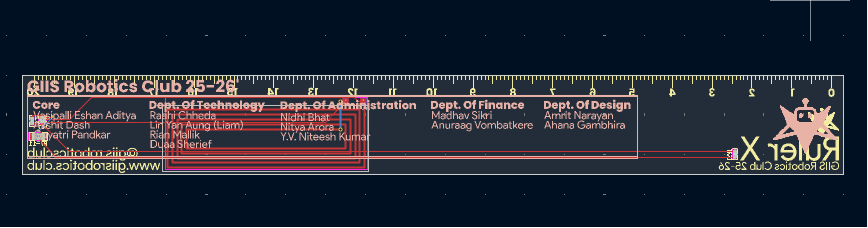
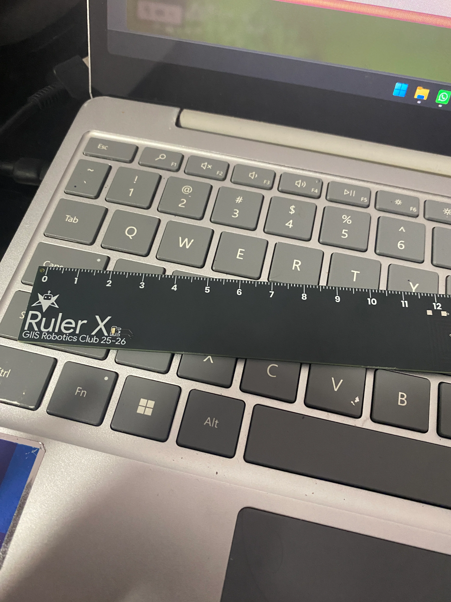
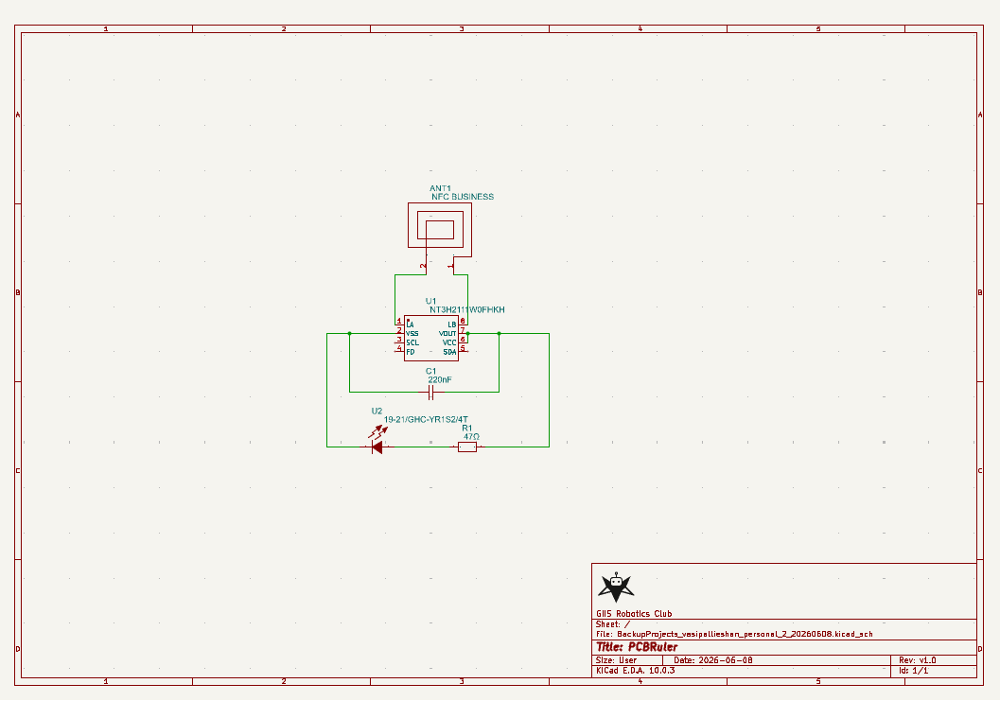
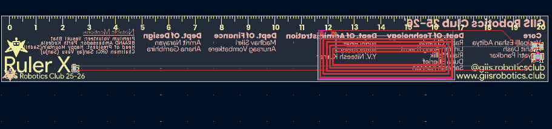

# RulerX

RulerX is a smart ruler which also acts as an NFC tag, allowing you to share you favourite websites and contact details with just a tap. This ruler has been designed with the intention of being given as a momento to the team at the GIIS Robotics Club.

View the demo at [user-cdn.hackclub-assets.com/019f37bf-e643-794e-a864-747f67c8363c/e4663d0b-7505-419f-bef5-393dbbf44ca0.MP4](https://user-cdn.hackclub-assets.com/019f37bf-e643-794e-a864-747f67c8363c/e4663d0b-7505-419f-bef5-393dbbf44ca0.MP4)

# Important Links

- [RulerX/production/BOM.csv at main · Vasipallie/RulerX](https://github.com/Vasipallie/RulerX/blob/main/production/BOM.csv) BOM.CSV file
-

# Bill of Materials

| Comment            | Designator | Footprint                                | JLCPCB Part # | Price (USD) |
| ------------------ | ---------- | ---------------------------------------- | ------------- | ----------: |
| NFC BUSINESS       | ANT1       | NFC ANTENNA                              | —             |           — |
| 220nF              | C1         | C0603                                    | C64705        |      $0.010 |
| 47Ω                | R1         | R1206                                    | C2889662      |      $0.003 |
| NT3H2111W0FHKH     | U1         | XQFN-8_L1.6-W1.6-P0.50-BL_NT3H2111W0FHKH | C710403       |      $0.808 |
| 19-21/GHC-YR1S2/4T | U2         | LED0603-R-RD                             | C2986048      |      $0.026 |
| **TOTAL**          |            |                                          |               |  **$0.847** |

# Schematic and PCB

## Notes:

All schematic and PCB files have been provided in the source folder. These can be modified accordingly to suit your personal needs.

Production files have been provided under the production folder, this can be used to manufacture an exact replica of the NFC ruler.

Production folder:

1. BOM.xlsx (Bill of materials in XLSX format)
2. grburger.zip (Gerber files for machining)
3. PCLK.csv (Pick and Place file)

Please note that these production files have been made specifically for JLCPCB (which is what I am using for PCB manufacturing), you may need to adjust them accordingly for other PCB manufacturers (Please see their requirements on their website).

# Contribution

If you feel like there should be other features embedded into this PCB Ruler, you are free to make changes and open a pull request. I will review them and approve accordingly
